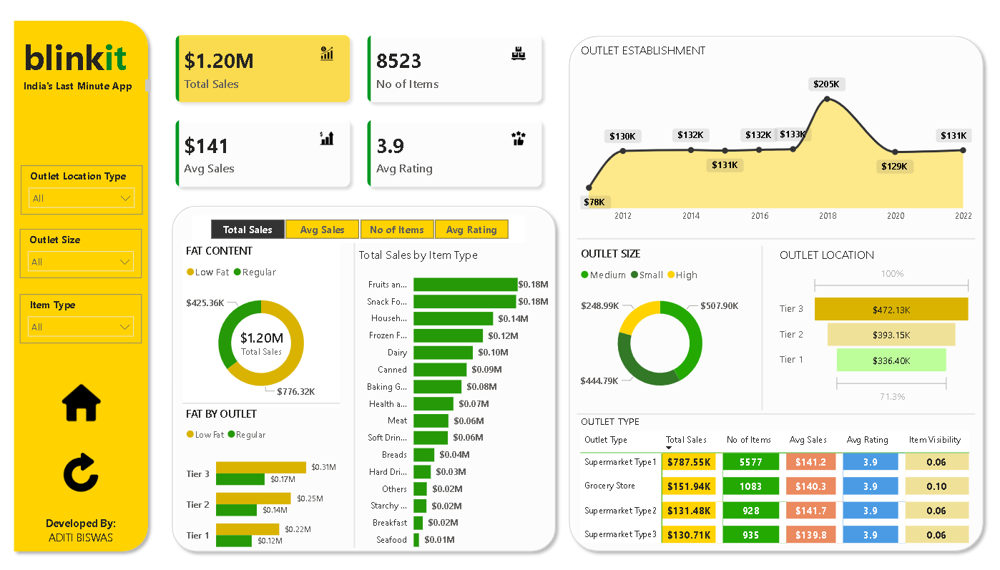

# Blinkit Sales Analytics Dashboard

## Overview

This project presents an interactive Business Intelligence dashboard developed in Power BI using Blinkit grocery sales data. The objective was to transform raw transactional data into actionable business insights that support strategic decision-making.

The dashboard provides a comprehensive view of sales performance, outlet effectiveness, product category contribution, customer ratings, and operational trends through dynamic visualizations and KPI tracking.

---

## Dashboard Preview

---

## Business Problem

Retail businesses generate large volumes of transactional data every day. Without proper analysis, it becomes difficult to identify:

* High-performing product categories
* Revenue-driving outlet locations
* Customer satisfaction trends
* Sales distribution across outlet types
* Growth opportunities for business expansion

This dashboard was developed to convert raw sales data into meaningful insights that can help management make data-driven decisions.

---

## Key Performance Indicators (KPIs)

| KPI             | Value  |
| --------------- | ------ |
| Total Sales     | $1.20M |
| Average Sales   | $141   |
| Number of Items | 8,523  |
| Average Rating  | 3.9    |

---

## Dashboard Features

### Executive KPI Summary

Provides an instant overview of overall business performance through key metrics including total sales, average sales, product count, and customer ratings.

### Product Performance Analysis

* Sales by Item Type
* Fat Content Distribution
* Category-wise Revenue Contribution
* Product Segment Comparison

### Outlet Performance Analysis

* Outlet Establishment Trends
* Sales by Outlet Size
* Sales by Outlet Location Tier
* Outlet Type Comparison

### Interactive Filtering

Users can dynamically filter the dashboard by:

* Outlet Location Type
* Outlet Size
* Item Category

---

## Key Insights

### Product Insights

* Fruits and Vegetables generated the highest sales contribution.
* Snack Foods emerged as another major revenue driver.
* Seafood and Breakfast products recorded the lowest sales volume.

### Outlet Insights

* Tier 3 outlets generated the highest overall sales.
* Medium-sized outlets contributed the largest revenue share.
* Sales performance peaked among outlets established around 2018.

### Customer Insights

* Average customer rating remained consistently high at 3.9 across outlet categories.
* Product visibility showed a measurable impact on sales performance.

---

## Technical Skills Demonstrated

* Data Cleaning and Transformation
* Data Modeling
* DAX Measure Creation
* Interactive Dashboard Design
* KPI Development
* Business Intelligence Reporting
* Data Visualization Best Practices
* Retail Sales Analytics

---

## Tools & Technologies

* Power BI Desktop
* Microsoft Excel
* DAX (Data Analysis Expressions)
* Power Query

---

## Project Outcomes

This project demonstrates the ability to convert raw business data into executive-level reporting dashboards. The final solution enables stakeholders to monitor performance, identify trends, evaluate outlet efficiency, and make informed business decisions using data-driven insights.

---

## Author

Aditi Biswas
